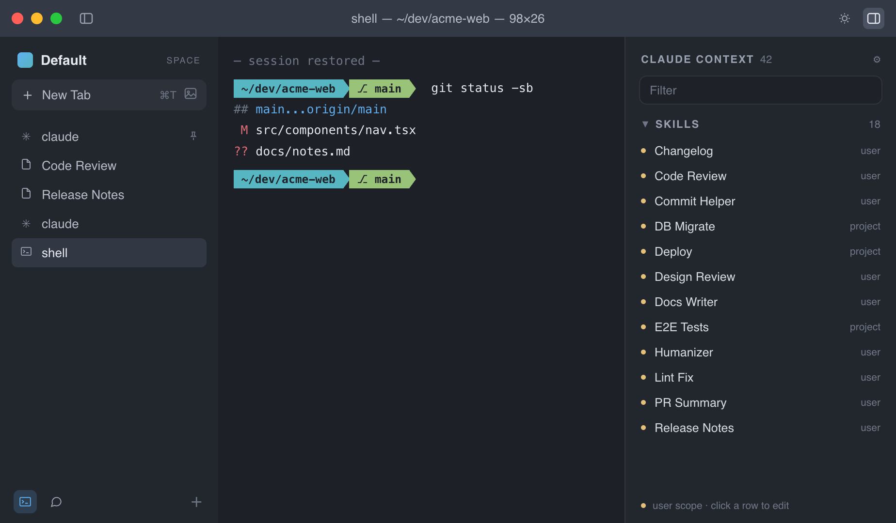
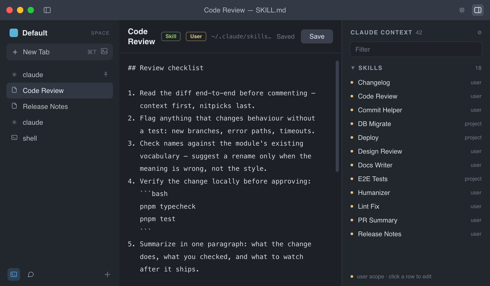

# Zede

A terminal built for [Claude Code](https://claude.com/claude-code). Arc-style Spaces for switching between projects without the tab hunt, and one panel to finally see every memory, skill, and plugin Claude has loaded.



## Demo

<!--
  Demo video slot. To add one:
  record a short screen capture (20-40s, ~1280x800 reads well), then on GitHub drag the
  .mp4/.mov into an issue or the README editor to get a hosted user-attachments URL, and
  replace the line below with that link (GitHub renders it as an inline player).
-->

> **Demo video coming soon.** For now, the screenshots in this README show the main window and the Claude Context panel.

## Why

If you work on more than one project with Claude Code, you already know the two problems:

1. **Switching projects back-to-back is tedious.** A plain terminal gives you an undifferentiated pile of tabs — no grouping, no memory of what belongs where.
2. **Claude's context is invisible.** Memory, skills, plugins, MCP tools — most people don't know what's loaded for a given session, let alone how to manage or edit it. There's no UI for any of it today.

Zede fixes both:

- **Arc-style Spaces & tabs** — group sessions into Spaces the way Arc groups browser tabs. One Space per project or client, switch instantly instead of hunting through terminal windows.
- **See what Claude actually knows** — every skill, plugin, and MCP tool available to the current session, searchable, in one sidebar. No more guessing what's installed or digging through config files.
- **Local memory** — Zede watches your Claude Code transcripts and distills durable facts, decisions, and preferences into a searchable memory store that persists across sessions and restarts. It never leaves your machine.
- **Conversations you can't lose** — save any tab's Claude conversation to a local JSON snapshot and load it back later; the session resumes right where it stopped, optionally compacting its context on the way in. Pinned tabs go further: quit the app, reopen it, and they pick their last session back up automatically.
- **Sync across machines — to a repo you own** — optionally sync your memories, Spaces, and preferences through a private GitHub repo (or any git remote). No vendor server, no account with us: the files are plain markdown you can open and read, and deletions ("forgets") propagate too.
- **Native feel** — real macOS window chrome, themeable terminal (ships with One Dark), no browser-in-a-box weirdness.

You can also open and edit any skill or plugin file right from the Claude Context panel, without leaving the app:



## Saved conversations & session restore

Long Claude conversations are work products — losing one to a closed tab or a pruned transcript hurts. Zede gives you two layers of protection, both fully local:

**Save a conversation.** Right-click any Claude tab → **Save conversation**, give it a name, done. The snapshot is a plain JSON file (in the app's data folder) holding the full raw transcript plus metadata, so it survives even if Claude Code later prunes its own transcript files.

**Load it back.** The history button in the sidebar (next to the new-tab buttons) lists every save with its date and message count. Each entry offers:

- **Load conversation** — restores the transcript if needed, opens a new tab in the original working directory, and resumes the exact session with `claude --resume`. You continue the thread, context intact.
- **Load & compact context** — same, then automatically runs `/compact` once the session settles. Ideal for very long conversations: you get the thread back *and* a lean context window in one step.
- **Rename save / Delete save** — housekeeping.

**Pinned tabs restore themselves.** Quit the app and reopen it: every pinned Claude tab automatically resumes its last session instead of starting cold — your standing project threads are just *there*, like pinned tabs in a browser. Restore only happens on relaunch (exiting a session mid-run still gives you a fresh start), skips gracefully if the transcript is gone, and can be turned off in Settings (`⌘,`) → *Pinned tabs resume their last Claude session on relaunch*.

## Sync across machines

Work on a laptop and a desktop? Sync carries your Claude context — memories, forget decisions, Spaces, and preferences — between them through a **private git repo that you own**. There is no Zede server and no account: the app talks only to github.com (or whatever remote you choose), on your behalf.

**Set it up** in Settings (`⌘,`) → **Sync**:

1. **Sign in with GitHub.** Zede shows a short code and opens `github.com/login/device` — enter the code there. Sign-in uses a GitHub App, so in the next step GitHub asks which repositories to allow: pick *only* your sync repo. The app's sole permission is "repository contents"; it physically cannot see anything else you have on GitHub.
2. **Create the repo and grant access.** Two buttons walk you through it: one opens a prefilled new-repo page (private, default name `zede-sync`), the other opens the GitHub App's repo-selection page.
3. **Choose plaintext or encrypted.** Plaintext (default) keeps the repo human-readable — open it on github.com and read exactly what synced, one markdown file per memory. Or set a passphrase to encrypt memory contents before they leave your machine (you'll enter the passphrase once on each new machine; the repo is no longer readable on the web).
4. **Connect & sync.** On your other machine, repeat with the same repo. That's it.

After setup, Zede syncs once shortly after launch, plus whenever you hit **Sync now**. The status line always shows the last result ("pulled 2 · pushed changes"). Nothing syncs in the background beyond that.

Prefer not to sign in through the app? Two alternatives, same Settings section:

- **gh CLI** — if you're logged into the [GitHub CLI](https://cli.github.com), Zede can just shell out to it and never handles a credential at all.
- **Any git remote** (advanced) — point sync at GitLab, a bare repo on a NAS over ssh, anything your system git can push to.

**What syncs:** memories (and edits to them), forgets — deleting a memory on one machine deletes it everywhere, and it stays deleted — Spaces, and appearance/behavior preferences. **What never syncs:** terminal sessions and scrollback, transcripts, saved conversation snapshots, machine-local paths, and keys. Conflicts resolve automatically: the most recent edit wins, and the losing version is kept in that machine's local edit history. Offline? Changes queue locally and push on the next successful sync.

## Install

Heads up: this project doesn't have a paid Apple Developer account, so the Mac app isn't code-signed or notarized. macOS quarantines unsigned apps downloaded from the web and shows a "damaged" or "unidentified developer" warning. **The recommended way to run Zede is to build it from source** — an app you build on your own machine is never quarantined, so it just opens, with nothing to work around.

### Recommended: clone and build

You'll need [Node 22+](https://nodejs.org), [pnpm](https://pnpm.io/installation), and the `claude` CLI on your PATH.

```bash
git clone https://github.com/goldinitp/zede.git
cd zede
pnpm install
pnpm rebuild      # rebuild native modules (better-sqlite3, node-pty) for Electron
pnpm dist         # package the app → dist/
```

When it finishes, the packaged app is in `dist/` (for example `dist/mac-arm64/Zede.app`). Drag it to Applications and open it — no Gatekeeper warning, because you built it locally.

Just want to hack on it? Run `pnpm dev` for a live-reloading development build instead of packaging.

### Alternative: download a prebuilt release

Prebuilt `.dmg` / `.zip` builds are on the [Releases](../../releases) page. They work, but since they're unsigned, macOS blocks them on first launch. After copying Zede to Applications, clear the quarantine flag once:

```bash
xattr -cr /Applications/Zede.app
```

Then open it normally. (On some macOS versions you can instead open the app once and then approve it under **System Settings → Privacy & Security → Open Anyway**, but for unsigned apps the `xattr` command is the reliable route.) If the project gets signing set up later, this step goes away.

Windows and Linux builds are on the roadmap — the app is Electron, so both are possible.

### Forks and self-builds

The in-app "Sign in with GitHub" sync flow is tied to a registered GitHub App — set your own client id and app slug in `src/main/sync/githubAuth.ts` to use it. The gh CLI and git-remote sync options work without any registration.

## Status

Zede is early and under active development. Expect rough edges. Bug reports and pull requests are welcome — please open an issue before sending a large PR so we can agree on direction first.

## License

MIT — see [LICENSE](LICENSE).
