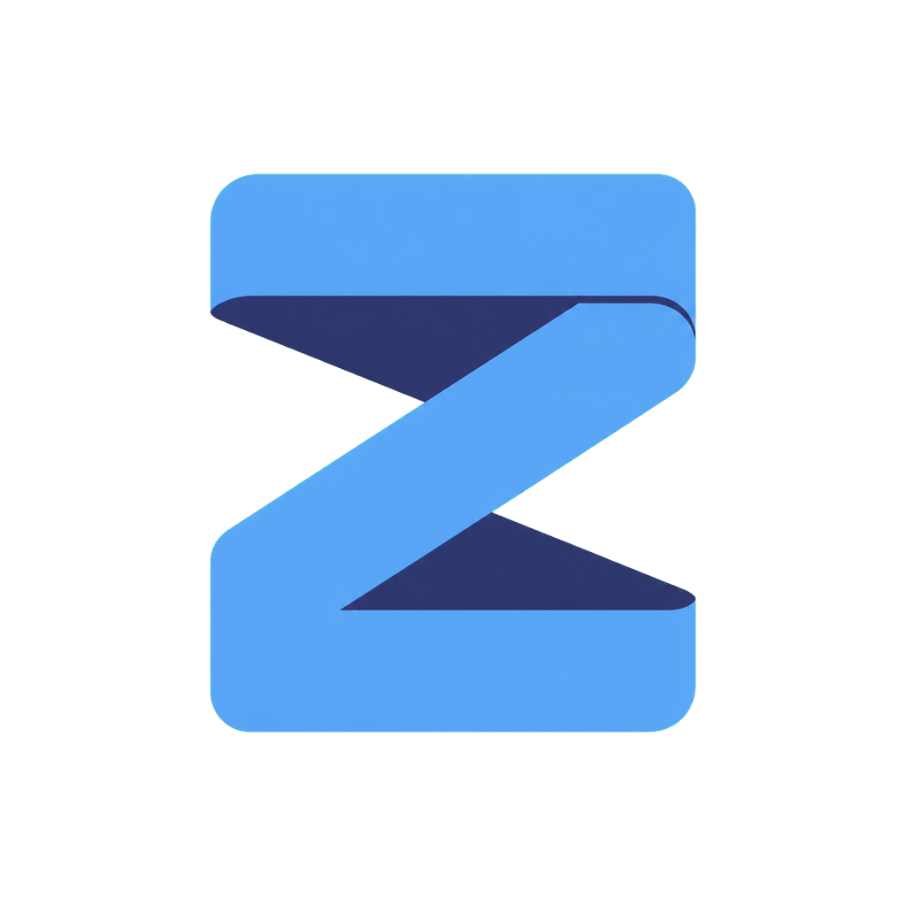
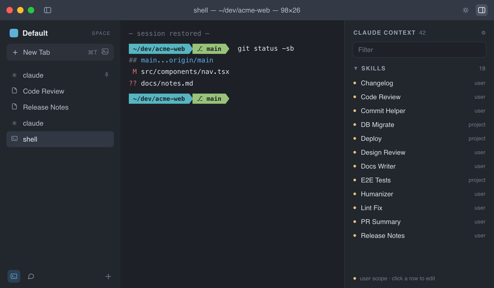
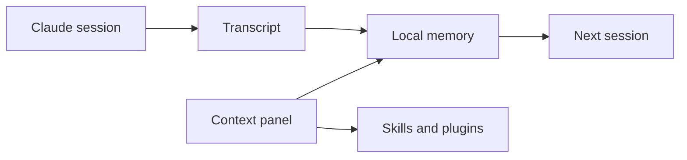
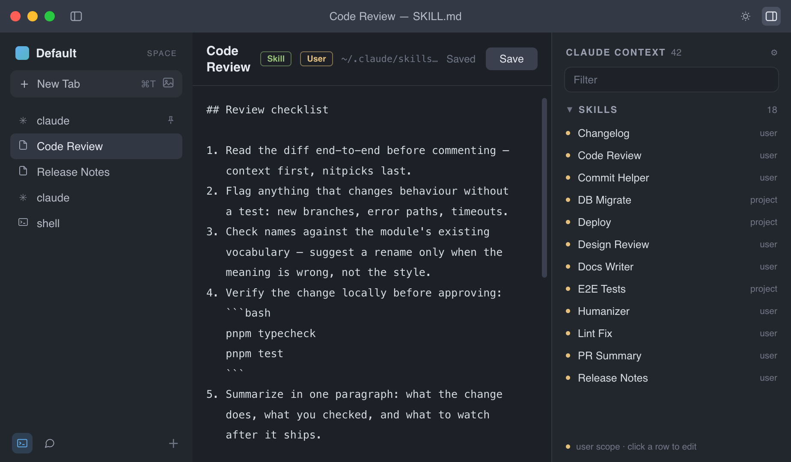

# Zede

<p align="center">
  
</p>

<p align="center">
  A desktop terminal that makes Claude Code easier to manage and inspect.
</p>



## Why it is interesting

- Real terminal sessions, grouped into project Spaces.
- One view for Claude memories, skills, plugins, and MCP tools.
- Local memory built from Claude transcripts.
- Saved conversations and pinned session restore.
- Optional sync through a git repo that you own.

The app does not replace your shell. Each tab runs a real PTY.


```mermaid
flowchart LR
    A[Claude session] --> B[Transcript]
    B --> C[Local memory]
    C --> D[Next session]
    E[Context panel] --> C
    E --> F[Skills and plugins]
```

## See and edit Claude context

Zede shows the files and memories available to Claude. File-backed skills and tools can be opened and edited inside the app.



## Privacy

The database stays on your computer.

The default memory extractor sends redacted text to Anthropic through `claude -p`. Choose the heuristic or Ollama extractor for offline use.

Sync is optional. It uses a git repo that you control.

## Why contribute

The codebase has practical systems work:

- Fast PTY streaming and terminal rendering.
- Incremental JSONL capture.
- Local search and memory ranking.
- Git sync with deletion and conflict rules.
- Electron packaging for macOS, Windows, and Linux.

The main app is TypeScript. Start with [REPO_MAP.md](REPO_MAP.md).

## Install on macOS

You need Node 22+, pnpm, and the `claude` CLI.

```bash
git clone https://github.com/goldinitp/zede.git
cd zede
pnpm build:app
```

Open the `.dmg` in `dist/`. Drag Zede into Applications.

The app is not signed or notarized. A local build should open normally.

## Development

```bash
pnpm install
pnpm run rebuild
pnpm dev
```

Before a pull request:

```bash
pnpm lint
pnpm typecheck
pnpm test
pnpm selftest
```

See [CONTRIBUTING.md](CONTRIBUTING.md) for project rules.

## Status

Zede is early software. Expect bugs.

## License

MIT. See [LICENSE](LICENSE).
