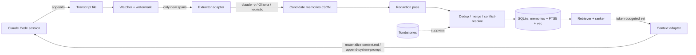
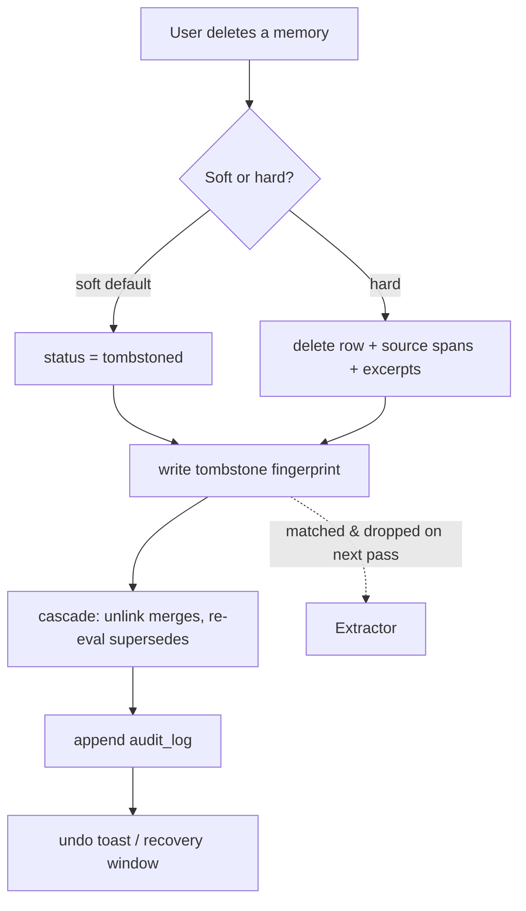

# Loom — Spec

> Working codename, rename freely. An Arc-like terminal shell (Spaces / tabs / pinning) for orchestrating Claude Code sessions, with conversation **memory as a first-class, locally-stored, user-deletable feature**.

---

## 1. One-liner

A GUI terminal where work is organized into **Spaces** (Arc-style), each Space runs one or more Claude Code **sessions** in pinned/unpinned **tabs**, and the app continuously distills those sessions into a **local SQLite memory store** that is scoped per-Space, ranked, re-injected into future sessions, and — critically — **deletable by the user in a way that actually sticks.**

---

## 2. Goals / Non-goals

**Goals**
- Arc's spatial model for terminals: Spaces > tabs > pins, persistent across restarts.
- Memory = distilled **facts / decisions / preferences / entities**, not raw transcripts.
- Memory store is **fully local** (SQLite + files), no network service, no telemetry, no cloud.
- First-class memory UI: view, search, pin, edit, and **delete** memories per-Space and globally.
- Deletion is **durable** — a deleted memory must not silently reappear on the next extraction pass.
- Retrieval is cheap enough to inject at session start without perceptible latency.

**Non-goals (v1)**
- Multi-device sync (explicitly deferred; local-only is a feature, not a limitation).
- Replacing Claude Code's own `CLAUDE.md` memory — Loom *layers on top* of the integration seam.
- A pure TUI. This is a GUI (visual Spaces sidebar is the whole point); a TUI is a possible later target.
- Training/fine-tuning anything. "Memory" here is retrieval + injection, not weight updates.

---

## 3. Mental model (and the Arc mapping)

| Arc concept | Loom concept | Notes |
|---|---|---|
| Space | **Space** | Top-level container. Owns its tabs *and its memory scope*. |
| Pinned tab | **Pinned tab** | Survives "clear", sorts above ephemeral tabs, optionally pins its memories too. |
| Tab | **Tab** | Hosts a PTY. Usually `claude`, but can be any shell/process. |
| (n/a) | **Session** | One Claude Code run inside a tab, with a transcript file + lifecycle. |
| (n/a) | **Memory** | A distilled, addressable unit derived from sessions, scoped to a Space or global. |

The key design decision: **a memory belongs to a Space the same way a tab does.** Opening a new `claude` session in Space "Instavision" sees Instavision's memories; it does not see "Morning-Signal-Pipeline" memories unless that memory is marked `global`.

---

## 4. Architecture

Three processes/layers, one binary:

1. **Shell (GUI)** — window, Spaces sidebar, tab bar, xterm.js terminal panes, memory panel.
2. **Core (Rust)** — PTY management, SQLite access, the memory pipeline, IPC to the shell.
3. **Extractor workers** — background tasks that turn transcript spans into candidate memories.

### 4.1 Capture → store → inject pipeline



The loop is closed: a session both *produces* memories (right side) and *consumes* them at start (the injection arrow back into Claude Code).

---

## 5. Data model (SQLite)

WAL mode, `PRAGMA user_version` for migrations, FTS5 for lexical search, `sqlite-vec` (vec0) for optional semantic search — all local, no extensions that phone home.

```sql
-- Spatial layer
CREATE TABLE spaces (
  id TEXT PRIMARY KEY, name TEXT NOT NULL, icon TEXT,
  settings_json TEXT, sort_order INTEGER, created_at INTEGER
);
CREATE TABLE tabs (
  id TEXT PRIMARY KEY, space_id TEXT REFERENCES spaces(id) ON DELETE CASCADE,
  kind TEXT,                -- 'claude' | 'shell' | 'process'
  title TEXT, cwd TEXT, pinned INTEGER DEFAULT 0, sort_order INTEGER,
  pty_snapshot_ref TEXT,    -- path to serialized scrollback/state for restore
  created_at INTEGER, last_active_at INTEGER
);
CREATE TABLE sessions (
  id TEXT PRIMARY KEY, tab_id TEXT REFERENCES tabs(id) ON DELETE CASCADE,
  cc_session_id TEXT,       -- Claude Code's own session id, if discoverable
  transcript_path TEXT, started_at INTEGER, ended_at INTEGER,
  status TEXT               -- 'live' | 'ended' | 'orphaned'
);
CREATE TABLE transcript_watermarks (
  session_id TEXT PRIMARY KEY REFERENCES sessions(id) ON DELETE CASCADE,
  last_offset INTEGER,      -- byte/line offset already processed (incremental)
  last_processed_at INTEGER
);

-- Memory layer
CREATE TABLE memories (
  id TEXT PRIMARY KEY,
  space_id TEXT,            -- NULL when scope='global'
  scope TEXT NOT NULL,      -- 'space' | 'global'
  type TEXT NOT NULL,       -- 'fact' | 'decision' | 'preference' | 'entity' | 'todo'
  content TEXT NOT NULL,    -- the distilled statement
  confidence REAL,          -- extractor confidence 0..1
  salience REAL,            -- decays over time, boosts ranking
  status TEXT NOT NULL,     -- 'active' | 'superseded' | 'tombstoned'
  pinned INTEGER DEFAULT 0,
  use_count INTEGER DEFAULT 0,
  source_hash TEXT,         -- semantic fingerprint (see tombstones)
  created_at INTEGER, updated_at INTEGER, last_used_at INTEGER
);
CREATE TABLE memory_sources (   -- provenance; one memory may have several
  memory_id TEXT REFERENCES memories(id) ON DELETE CASCADE,
  session_id TEXT, transcript_path TEXT,
  span_start INTEGER, span_end INTEGER, excerpt TEXT
);
CREATE TABLE memory_links (     -- lineage / relationships
  parent_id TEXT, child_id TEXT,
  relation TEXT                 -- 'merged_from' | 'supersedes' | 'refines' | 'contradicts'
);
CREATE TABLE memory_edits (     -- user corrections, audited
  id TEXT PRIMARY KEY, memory_id TEXT,
  kind TEXT,                    -- 'edit' | 'rescope' | 'pin' | 'unpin'
  before TEXT, after TEXT, created_at INTEGER
);

-- Forgetting layer
CREATE TABLE tombstones (
  id TEXT PRIMARY KEY,
  fingerprint TEXT NOT NULL,    -- normalized/semantic hash of forgotten content
  scope TEXT, space_id TEXT,
  reason TEXT, created_at INTEGER, created_by TEXT  -- 'user' | 'system'
);
CREATE TABLE redactions (        -- secret patterns stripped pre-storage
  pattern TEXT, kind TEXT        -- 'regex' | 'entropy'
);
CREATE TABLE audit_log (
  id TEXT PRIMARY KEY, ts INTEGER, action TEXT,
  target_type TEXT, target_id TEXT, detail_json TEXT
);

-- Search
CREATE VIRTUAL TABLE memories_fts USING fts5(content, content='memories', content_rowid='rowid');
CREATE VIRTUAL TABLE memories_vec USING vec0(embedding FLOAT[384]); -- optional tier
```

---

## 6. Memory lifecycle

### 6.1 Capture
A filesystem watcher tails each live session's transcript. Claude Code writes transcripts under its project dir (e.g. `~/.claude/projects/<hash>/...`); Loom resolves the path at session start and records it on the `sessions` row. **Incremental only** — the `transcript_watermarks.last_offset` guarantees each span is processed exactly once, so cost is O(new tokens), not O(transcript).

### 6.2 Extraction (tiered, you pick the tier)
Extraction is the one place that *can* touch a model. Note the honest tension with "no network": **the store and the app are local, but Claude Code itself is a network tool.** Three tiers, configurable, degrade gracefully:

1. **`claude -p` (default, best quality).** Shell out headless to the Claude Code you already run, no separate API key, reuses existing auth. This is the same headless `claude -p` → structured-JSON pattern as a typical Alexa/automation bridge — one batched call per debounced flush, JSON-only system prompt:
   ```
   System: You extract durable memories. Return ONLY a JSON array.
   Each item: {type, content, confidence, scope_hint, span:[start,end]}.
   type ∈ {fact,decision,preference,entity,todo}. No prose, no markdown.
   ```
2. **Local Ollama (truly offline).** Same prompt against a local model — a `qwen2.5-coder:7b`-class model is plenty for span→JSON extraction. Zero network. This is the tier to default to if "no network" is a hard constraint rather than "no *separate* backend."
3. **Heuristic (no model at all).** Regex/cue-phrase capture: `I (prefer|always|never) …`, `we decided …`, `the bug was …`, `<X> lives at <path>`. Low recall, zero dependency, instant — a fine fallback floor.

The tier is an adapter trait (`Extractor::extract(spans) -> Vec<Candidate>`); the rest of the pipeline is identical regardless of tier.

### 6.3 Normalize → redact → dedup → store
- **Redact first.** Before *anything* is persisted, run the redaction pass: known secret patterns (`sk-…`, AWS keys, `-----BEGIN … KEY-----`, JWTs, `password=`, high-entropy tokens). Matches are dropped or masked. Transcripts routinely contain pasted secrets; this is non-optional.
- **Dedup / merge.** Compute the semantic fingerprint; if it matches an existing active memory, bump `use_count`/`salience` instead of inserting. Near-duplicates (lexical + vector sim above threshold) **merge**, recording `merged_from` lineage.
- **Conflict / supersede.** If a new preference contradicts an old one ("I use tabs" → later "actually Spaces"), don't delete the old one — insert the new as `active`, mark the old `superseded`, link `supersedes`. This preserves *why the answer changed* and stays recoverable.

### 6.4 Retrieval & ranking
At session start, for the active Space, score candidates and fill a fixed **memory token budget** (e.g. reserve ~1–2k tokens of injected context). Greedy fill by score; pinned items are force-included first up to a pin sub-budget.

```
score = w_pin · pinned
      + w_rel · cosine(query_or_cwd_embedding, mem.embedding)   -- semantic tier only
      + w_lex · bm25(query, mem.content)
      + w_rec · exp(-Δt_last_used / τ)
      + w_freq· log(1 + use_count)
      + w_scope· scope_match(space)
      - w_age · staleness(mem)
```

"Query" is soft at session start (no user question yet), so seed it with **cwd + Space + recent tab titles**. Once the user types a real prompt, a second pass can refine. Target **< 50 ms p95** — FTS5 and vec0 are fast, embeddings are precomputed async, and the active-set per Space is cached in memory.

### 6.5 Injection
Behind a `ContextAdapter` trait because this seam is the most likely to shift with Claude Code's surface:
- **Adapter A (file):** materialize the selected set into a managed, gitignored `.loom/context.md` referenced by the project's memory file. Simple, transparent, user-inspectable.
- **Adapter B (flag/SDK):** pass via `--append-system-prompt` / the headless SDK at spawn.

Default to A (you can literally read what was injected); keep B for environments where the file route isn't honored.

---

## 7. Deletion & forgetting *(the headline feature — and the subtle one)*

A naive `DELETE FROM memories WHERE id=?` is **wrong**: the source transcript still exists, so the next extraction pass re-derives the exact same memory and it silently returns. Deletion must therefore be modeled as *forgetting*, not row removal.



Mechanics:
- **Soft delete (default).** Set `status='tombstoned'`, write a `tombstones` row with the **semantic fingerprint**. The dedup stage checks every new candidate against tombstone fingerprints and **drops re-derivations** — so forgetting sticks even though the source still exists. Recoverable within an undo window.
- **Hard delete.** Everything soft delete does *plus* purge the row, its `memory_sources` rows, and stored excerpts. Irreversible by design (this is the "right to be forgotten" path). The tombstone fingerprint still remains so it can't re-derive.
- **Cascade.** If the memory was merged into others, drop the `merged_from` edge and re-evaluate the survivor's salience; if it `superseded` an older one, optionally restore the older to `active` (ask, don't assume).
- **Semantic "forget about X".** A natural-language delete: embed "X", select all memories above a similarity threshold in scope, preview the set, confirm, then tombstone the batch with one fingerprint family. Distinct from deleting a single addressable row.
- **Audit + undo.** Every deletion appends to `audit_log` and raises an undo toast. The memory panel has a "Recently forgotten" view sourced from tombstones so nothing vanishes without a trace.
- **Scope-aware.** Deleting a Space asks what to do with its memories: cascade-delete, or promote `global`, or tombstone — user's choice, never silent data loss.

---

## 8. Terminal shell

- **Spaces sidebar** (left), Arc-style: reorderable, icon + name, switching swaps the whole tab set and the active memory scope.
- **Tabs** with pin affordance; pinned sort above ephemeral and survive "clear tabs". Optional setting: *pinned tab ⇒ pin its memories*.
- **PTY** per tab via `portable-pty`; terminal rendering with **xterm.js** in the webview (so your frontend skills apply directly to the UI).
- **Session persistence.** On quit, serialize scrollback + cwd + (best-effort) running-process intent to `pty_snapshot_ref`; on launch, restore the visual session. (Live process resurrection is out of scope — this restores *state and history*, tmux-style, not running PIDs.)
- **Memory panel** (right, collapsible): per-Space list grouped by type, search box (FTS + semantic toggle), inline pin/edit/delete, a "Just learned…" stream with undo, and the "Recently forgotten" view.

---

## 9. Security & privacy
- **Local-only guarantee.** No network egress from the app itself; the only outbound is whatever extraction tier *you* enable (and the offline Ollama tier has none). State the egress posture explicitly in settings.
- **Secret redaction** before persistence (§6.3) — the single most important safety control here.
- **Encryption at rest (optional).** SQLCipher; off by default for simplicity/perf, on for sensitive users. Keyed via OS keychain.
- Memory DB lives under the app data dir with `0600` perms; `.loom/` artifacts are gitignored by default.

---

## 10. Performance & concurrency
- **WAL mode** so the UI reads while the extractor writes; single writer, checkpoint on idle.
- **Debounced, batched extraction** (e.g. flush 5 s after last activity, or on session pause), capped at 1–2 concurrent `claude -p` calls so it never competes with your foreground session.
- **Incremental** via watermark offsets — never re-reads processed transcript.
- **Retrieval budget < 50 ms p95**; precompute embeddings async, cache active set per Space.
- Periodic `VACUUM`/FTS optimize on idle; integrity check on launch with FTS rebuild-from-`memories` if corrupt.

---

## 11. Edge cases & failure modes
- **Contradicting preferences** → supersede + link, never silent overwrite (§6.3).
- **Salience decay** → very stale, never-used memories auto-archive (not delete) below a floor.
- **Multi-Space facts** → `scope='global'` (or a future `space_membership` table if "some but not all" is needed).
- **Giant pastes** → cap span length; never store a 5k-line paste verbatim as a "memory".
- **Duplicate/orphaned sessions** → `status='orphaned'` when transcript path goes missing; stop tailing.
- **Schema evolution** → `user_version` + ordered migrations; tombstones and audit_log are never destructively migrated.
- **Extractor returns garbage JSON** → strict parse, drop the batch, log, retry next flush; never poison the store.

---

## 12. Recommended stack
- **Shell:** **Tauri** (Rust core + web UI). Small binary, native PTY, cross-platform incl. **Windows**, and a web frontend so your existing skills carry over 1:1. (Electron is the heavier alternative; a Rust/ratatui TUI is the "pure terminal" alternative if you ever want it.)
- **Terminal:** xterm.js (webview) ⇄ `portable-pty` (Rust).
- **Memory core:** Rust, `rusqlite` + FTS5 + `sqlite-vec`; `tokio` background worker.
- **Embeddings (offline):** `fastembed-rs` or Ollama's embeddings endpoint — local either way.
- **Extraction adapters:** `ClaudeCodeExtractor` (`claude -p`) / `OllamaExtractor` / `HeuristicExtractor`.

---

## 13. Phased build plan
- **Phase 0 — demo slice (days):** one Tauri window, one Space, an xterm.js pane running `claude`, transcript tail → `claude -p` extraction → SQLite → a memory sidebar listing memories, each with a delete **✕** that tombstones. No ranking, no injection yet. This is the smallest thing that *feels* like the product.
- **Phase 1:** Spaces + tabs + pinning, per-Space scoping, retrieval + injection via the `context.md` adapter, **tombstone-prevents-re-derivation**, soft/hard delete, redaction, audit log.
- **Phase 2:** semantic search (embeddings), supersede/conflict handling, salience decay, "forget about X" semantic delete, session persist/restore, Ollama offline tier, optional encryption.
- **Phase 3:** polish — undo toasts, memory diff/edit view, export, "Recently forgotten", multi-Space membership.

---

## 14. Open decisions
1. **Injection seam stability** — file (`context.md`) vs flag/SDK; pick the one Claude Code honors most reliably in your setup, keep both behind the adapter.
2. **Transcript discovery** — confirm the exact path Claude Code writes per session, and how to bind it to a Loom tab deterministically.
3. **Default scope** — per-Space vs per-repo. Spaces ≈ projects, so per-Space is the natural default, but repos can outlive Spaces.
4. **Embedding model** — bundle a small one (fastembed) vs reuse Ollama. Bundling = zero external dep.
5. **Pinned-tab ⇒ pinned-memory** — on by default, or an explicit per-tab toggle?
